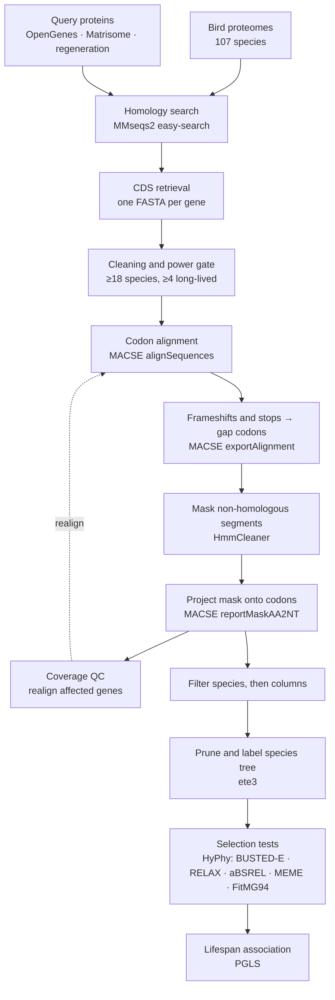

<h1 align="center">all_that_bird_funk</h1>

<p align="center">
  <b>Comparative genomics of avian longevity</b><br>
  Signatures of selection in ageing-related genes across 107 bird species
</p>

---

Birds break the usual rule that small animals die young: a 20-gram swift can
outlive a dog. This pipeline asks whether that shows up in their genomes — it
searches for signatures of selection (dN/dS) in genes tied to the hallmarks of
ageing, then tests those signatures against how long each species actually lives.

Species in the top 20% by longevity quotient (LQ — lifespan corrected for body
mass) are treated as long-lived and form the **foreground** branch set for every
selection test.

## Pipeline



## Input data

| | |
|---|---|
| **Sequences** | proteomes, CDS and genome annotations for the bird species |
| **Traits** | body mass and maximum lifespan per species, from which LQ is derived |
| **Queries** | amino acid sequences of genes of interest: OpenGenes ageing categories, Matrisome Project, tissue regeneration sets |
| **Phylogeny** | a species tree covering the sampled species |

## Steps

| # | Step | Tool | Notes |
|---|---|---|---|
| 1 | Homology search | MMseqs2 `easy-search` | `-c 0.2 --min-seq-id 0.3 --alt-ali 25`, best hit per species. The target database keeps one longest isoform per gene, so the gene set stays comparable with orthology-based runs |
| 2 | CDS retrieval | — | the coding sequence behind each protein hit, collected per gene |
| 3 | Cleaning and gate | — | species names reduced to binomials; fragments shorter than 10% of the gene mean dropped; a gene is kept only with ≥18 species and ≥4 long-lived species |
| 4 | Codon alignment | MACSE `alignSequences` | frameshift-aware alignment of coding sequences |
| 5 | Export | MACSE `exportAlignment` | frameshifts and stop codons — including the terminal one — become whole gap codons, since HyPhy rejects alignments containing stop codons |
| 6 | Masking | HmmCleaner `--large --specificity` | masks locally non-homologous segments with a plain gap |
| 7 | Mask transfer | MACSE `reportMaskAA2NT` | the amino-acid mask is projected onto the nucleotide alignment, codon by codon |
| 8 | Coverage QC | — | a sequence delivering under 30% of the codons of its own CDS is removed from the inputs and its gene is realigned from scratch |
| 9 | Filtering | — | a species losing over 50% of its own length is dropped; a codon column occupied in under 50% of the remaining species is deleted — species first, then columns |
| 10 | Trees | ete3 | the species tree is pruned to each gene's species and labelled `{Foreground}` / `{Background}` |
| 11 | Selection | HyPhy | BUSTED-E, RELAX, aBSREL, MEME, FitMG94 |
| 12 | Association | PGLS | selection statistics against LQ, phylogeny-aware |

Sequence and column thresholds follow Botero-Castro et al. (2017).

Alignment cleaning is deliberately ordered. Species are removed before columns,
because dropping a species removes it from both numerator and denominator and so
raises the occupancy of the remaining columns. Columns are deleted rather than
masked: a masked column stays in the file and HyPhy still counts it.

Every step that deletes columns records an old→new index map, so site
coordinates reported by MEME can be translated back to the original alignment.

## Running the selection analyses

Every HyPhy call passes `ENV=TOLERATE_NUMERICAL_ERRORS=1`. Without it a fraction
of genes aborts with `Internal error in ComputeBranchCache`, which reflects
numerical instability on large alignments rather than a problem with the data.
The flag is global and precedes the analysis name:

```bash
hyphy CPU=1 ENV=TOLERATE_NUMERICAL_ERRORS=1; busted \
    --alignment <gene>_binomial_NT.fasta \
    --tree      <gene>_labeled.nwk \
    --branches  Foreground \
    --error-sink Yes \
    --output    <gene>_busted.json
```

`busted_e_run.py` runs this across the whole gene set: one process per core, a
worker cap adjustable while the run is in flight, a per-gene timeout, and
automatic back-off when other users load the machine.

**Statistics.** P-values are corrected with Benjamini-Hochberg. Methods that
estimate π₀, such as Storey q-values, are *not* applicable: they assume the null
distribution of p-values is uniform, whereas the BUSTED null is a 50:50 mixture
of χ²₀ and χ²₁ and its p-values never exceed 0.5.

## Contents

| File | Role |
|---|---|
| `pipeline.ipynb` | the main notebook — all stages, from homology search to final tables |
| `cicl_mmseq_easy_search.sh` | homology search |
| `build_primary_merged.py` | builds the one-isoform-per-gene target database |
| `qc_redo_lowcov.py` | coverage QC and realignment of affected genes |
| `rebuild_labeled_trees.py` | pruning and labelling of per-gene trees |
| `busted_e_run.py` | BUSTED-E across the full gene set |
| `orphan_timeout_guard.py` | timeout enforcement for detached analysis jobs |
| `relax_run.sh`, `absrel.sh`, `run_meme.sh`, `run_fitmg94.sh`, `run_busted_background.sh` | the remaining HyPhy analyses |
| `pruned_tree.nwk` | species tree |

## References

- Ranwez V., Douzery E.J.P., Cambon C., Chantret N., Delsuc F. **MACSE v2.** *Mol Biol Evol* 2020.
- Di Franco A., Poujol R., Baurain D., Philippe H. **HmmCleaner.** *BMC Evol Biol* 2019.
- Botero-Castro F., Figuet E., Tilak M.-K., Nabholz B., Galtier N. **Avian genomes revisited.** *Mol Biol Evol* 2017.
- Kosakovsky Pond S.L. et al. **HyPhy 2.5.** *Mol Biol Evol* 2020. · Murrell B. et al. **BUSTED.** *Mol Biol Evol* 2015.
- Steinegger M., Söding J. **MMseqs2.** *Nat Biotechnol* 2017.
