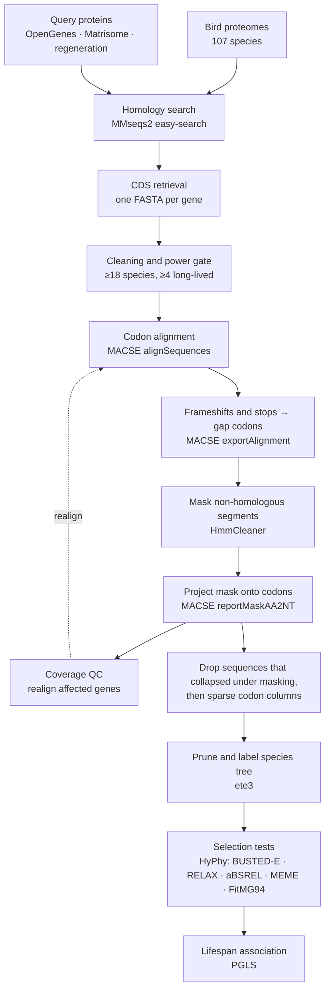

<h1 align="center">all_that_bird_funk</h1>

<p align="center">
  <b>Comparative genomics of avian longevity</b><br>
  Signatures of selection in ageing-related genes across 107 bird species
</p>

---

Birds live two to three times longer than mammals of comparable body mass, at
metabolic rates two- to fivefold higher, body temperatures of 40 to 42 °C and blood
glucose around 275 mg/dL in a 1 kg bird. Long life has arisen repeatedly in unrelated
avian lineages. This pipeline searches for episodic diversifying selection in
ageing-associated genes across those lineages and relates it to size-corrected
longevity.

Maximum lifespan scales with body mass, so the analysis uses LQ. An allometric
regression log₁₀(L) = β₀ + β₁·log₁₀(M) is fitted across the sampled species, and LQ is
observed lifespan divided by predicted lifespan. The top 20% of LQ form the
**foreground** branch set for the branch-site tests. The PGLS uses LQ as a continuous
variable.

## Pipeline



## Input data

| | |
|---|---|
| **Sequences** | proteomes, CDS and genome annotations for the bird species |
| **Traits** | body mass and maximum lifespan per species, from which LQ is derived |
| **Queries** | amino acid sequences of genes of interest: OpenGenes ageing categories, Matrisome Project, tissue regeneration sets |
| **Phylogeny** | a species tree covering the sampled species |

## Steps

| # | Step | Tool | Notes |
|---|---|---|---|
| 1 | Homology search | MMseqs2 `easy-search` | `-c 0.2 --min-seq-id 0.3 --alt-ali 25`, best hit per species. The target database keeps one longest isoform per gene, so a gene is represented once per species |
| 2 | CDS retrieval | custom code | the coding sequence behind each protein hit, collected per gene |
| 3 | Cleaning and gate | custom code | species names reduced to binomials; fragments shorter than 10% of the gene mean dropped; a gene is kept only with ≥18 species and ≥4 long-lived species |
| 4 | Codon alignment | MACSE `alignSequences` | frameshift-aware alignment of coding sequences |
| 5 | Export | MACSE `exportAlignment` | frameshifts and stop codons, including the terminal one, become whole gap codons, since HyPhy rejects alignments containing stop codons |
| 6 | Masking | HmmCleaner `--large --specificity` | scores every residue against an HMM profile built from the alignment itself and masks segments that do not fit it. In practice these are mispredicted exons and frameshifted stretches |
| 7 | Mask transfer | MACSE `reportMaskAA2NT` | the amino-acid mask is projected onto the nucleotide alignment, codon by codon |
| 8 | Coverage QC | custom code | a sequence delivering under 30% of the codons of its own CDS is removed from the inputs and its gene is realigned from scratch |
| 9 | Filtering | custom code | a sequence retaining under half of its own length after masking is dropped from that gene. The species stays in every other gene. Then a codon column occupied in under 50% of the remaining sequences is deleted, since ω at a column supported by three species is not an estimate. Sequences first, then columns |
| 10 | Trees | ete3 | the species tree is pruned to each gene's species and labelled `{Foreground}` / `{Background}` |
| 11 | Selection | HyPhy | BUSTED-E: is there ω > 1 at some sites on some foreground branches, with an error sink absorbing alignment artefacts. RELAX: is selection intensified or relaxed on the foreground (K). aBSREL: which branches. MEME: which codons, and which lineages drive each. FitMG94 `--type lineage`: per-species ω for the regression |
| 12 | Association | PGLS | LQ regressed on per-species root-to-tip ω, Brownian-motion covariance from the pruned tree |

The cleaning scheme follows Botero-Castro et al. (2017), with two changed thresholds:
column occupancy 50% (60% in the paper) and HmmCleaner in `--specificity` mode. The
HmmCleaner authors report specificity dropping in fast-evolving regions, which is
where the signal here is. Measured on this dataset, that mode masks 0.8% of residues
and shifts the column filter outcome by 0.04%.

Sequences are removed before columns: dropping a sequence removes it from both
numerator and denominator, so the occupancy of the remaining columns rises. Columns
are deleted, not masked, because a masked column stays in the file and HyPhy still
counts it.

Every step that deletes columns records an old→new index map, so site coordinates
reported by MEME can be translated back to the original alignment.

## Running the selection analyses

Every HyPhy call passes `ENV=TOLERATE_NUMERICAL_ERRORS=1`. Without it a fraction of
genes aborts with `Internal error in ComputeBranchCache`, which HyPhy reports as
numerical instability on large alignments. The flag is global and precedes the
analysis name:

```bash
hyphy CPU=1 ENV=TOLERATE_NUMERICAL_ERRORS=1; busted \
    --alignment <gene>_binomial_NT.fasta \
    --tree      <gene>_labeled.nwk \
    --branches  Foreground \
    --error-sink Yes \
    --output    <gene>_busted.json
```

`busted_e_run.py` runs this across the whole gene set: one process per core, a worker
cap adjustable while the run is in flight, a per-gene timeout, and back-off when other
users load the machine.

**Statistics.** P-values are corrected with Benjamini-Hochberg. Methods that estimate
π₀, such as Storey q-values, are not applicable: they assume the null distribution of
p-values is uniform. The BUSTED null is a 50:50 mixture of χ²₀ and χ²₁, and its
p-values never exceed 0.5.

## Limitations

- Bird sequences are best MMseqs2 hits per human query. Orthology was not inferred
  formally; a reciprocal best hit run retained 47 records.
- 342 of 3403 genes are excluded as too long to align (median CDS 5313 nt against
  1275 for the rest; MACF1 is 22 479 nt). The gene set is biased against long CDS.
- DIO2, SELENOP and MT-CYB are run separately. Selenocysteine is encoded by TGA,
  which MACSE reads as a stop codon; MT-CYB needs `-gc_def 2`.

## Contents

| File | Role |
|---|---|
| `pipeline.ipynb` | the main notebook: all stages, from homology search to final tables |
| `cicl_mmseq_easy_search.sh` | homology search |
| `build_primary_merged.py` | builds the one-isoform-per-gene target database |
| `qc_redo_lowcov.py` | coverage QC and realignment of affected genes |
| `rebuild_labeled_trees.py` | pruning and labelling of per-gene trees |
| `busted_e_run.py` | BUSTED-E across the full gene set |
| `orphan_timeout_guard.py` | timeout enforcement for detached analysis jobs |
| `relax_run.sh`, `absrel.sh`, `run_meme.sh`, `run_fitmg94.sh`, `run_busted_background.sh` | the remaining HyPhy analyses |
| `pruned_tree.nwk` | species tree |

## References

- Ranwez V., Douzery E.J.P., Cambon C., Chantret N., Delsuc F. **MACSE v2.** *Mol Biol Evol* 2020.
- Di Franco A., Poujol R., Baurain D., Philippe H. **HmmCleaner.** *BMC Evol Biol* 2019.
- Botero-Castro F., Figuet E., Tilak M.-K., Nabholz B., Galtier N. **Avian genomes revisited.** *Mol Biol Evol* 2017.
- Kosakovsky Pond S.L. et al. **HyPhy 2.5.** *Mol Biol Evol* 2020. · Murrell B. et al. **BUSTED.** *Mol Biol Evol* 2015.
- Steinegger M., Söding J. **MMseqs2.** *Nat Biotechnol* 2017.
